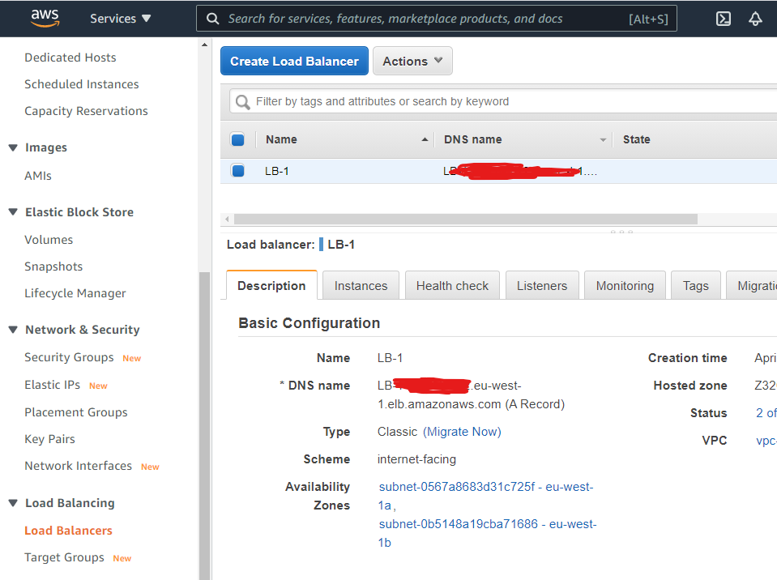
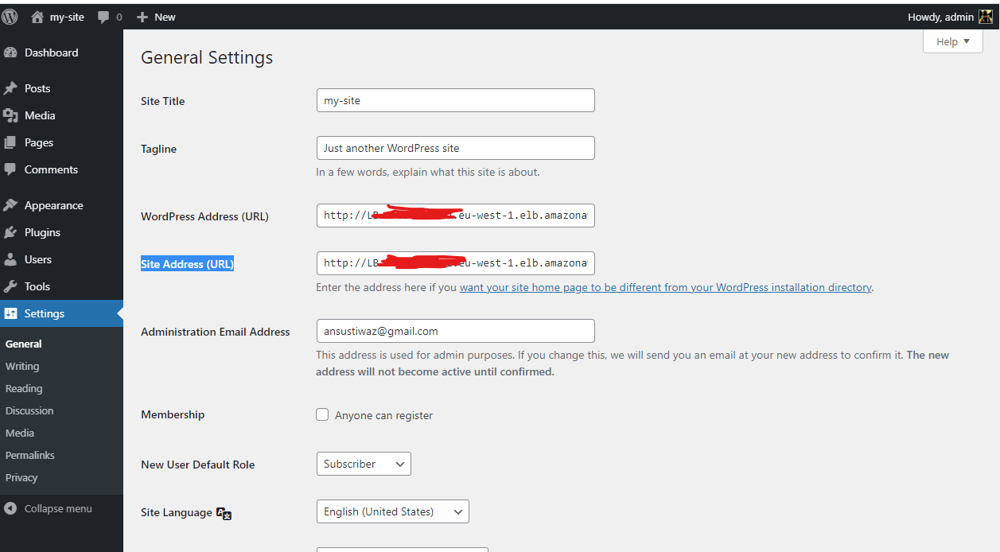
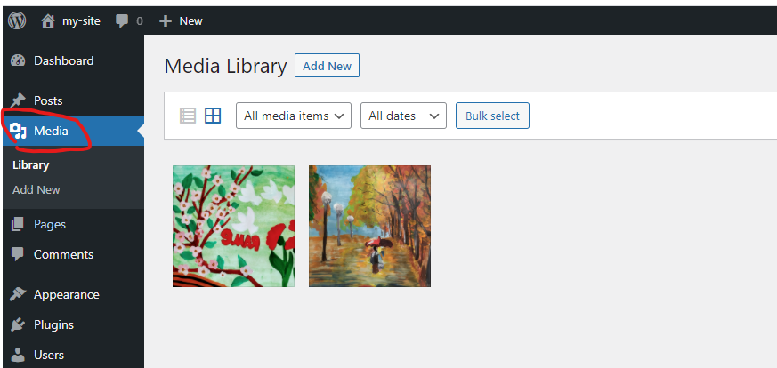
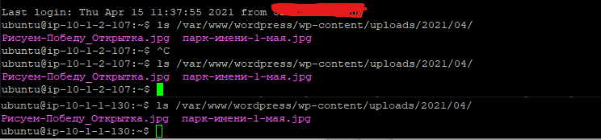

# aws-homework

At initial step you should create `EC2_Tutor` key pair in AWS console, or use any you want, just change the name in `variables.tf` file, you can also change region in that file. 

You may also need to comment my backedn settings on top of the `main.tf` file

    backend "s3" {
        bucket = "terra-back-1339"
        key    = "project-1/terraform.tfstate"
        region = "eu-north-1"
        dynamodb_table = "terraform_lock"
    }

At first apply terraform plan:

    terraform init
    terraform plan
    terraform apply

It will create: 1 VPC, 2 Subnets (in different AZ), 2 routes, 2 Internet Gateways, 2 EC2 Ubuntu instances in different subnets, 2 Security groups, and 1 Load Balancer and assign Public Ips to EC2 instances. Now you can connect to EC2 ubuntu hosts using their Public IPs. To get an IPs I added output of Public IPs to terrafrom `main.cf` plan, if they does not appear try to run `terraform refresh`.

Next, create RDS Aurora instance in created AZ using this [guide](https://docs.aws.amazon.com/elasticbeanstalk/latest/dg/php-hawordpress-tutorial.html#php-hawordpress-tutorial-database) Don't expose it to the world, please use Security group `db-sg` to limit access

Next, create wp database in db instance from any EC2 instance created early by terraform plan. 

    mysql -u admin -p -h <cluster name>.cluster-<cluster token>.eu-west-1.rds.amazonaws.com
    CREATE DATABASE wp;
    CREATE USER 'wpuser' IDENTIFIED BY 'pa$$w0rd';
    GRANT ALL PRIVILEGES ON wp.* TO 'wpuser';
    FLUSH PRIVILEGES;
    
    ### to drop (delete) table:
    ### DROP DATABASE wp;

Next add to `<cluster name>.cluster-<cluster token>.eu-west-1.rds.amazonaws.com` line to install_apache.sh script and run:

    terraform apply

It will recreate EC2 instances.

Next is time to created EFS in created early Availability Zones, using [EFS console](https://eu-west-1.console.aws.amazon.com/efs), choose newly created VPC "wordpress-vpc-1", and as for security groups you should choose "allow_1" and "allow_2" for according availability Zone

Next, mount file share to every wordpress EC2 instance:

    sudo mkdir -p /var/www/wordpress/wp-content/uploads
    sudo mount -t nfs4 -o nfsvers=4.1,rsize=1048576,wsize=1048576,hard,timeo=600,retrans=2,noresvport <fs token>.efs.eu-west-1.amazonaws.com:/ /var/www/wordpress/wp-content/uploads
    sudo chown www-data:www-data /var/www/wordpress/wp-content/uploads

Thats all!

# Let's set up our Wordpress instance
To connect to wordpress you should use one of the public IPs of EC2 instances. I add output of Public IPs to terrafrom `main.cf` plan, if they does not appear try to run `terraform refresh`

    http://<public ip>

Create initial config, save login and password. 

Next, go to Settings and past to  `WordPress Address (URL)` and `Site Address (URL)` address of our load balancer, for example:

Save and now use address of our LB to connect to wordpress host. Everyting should works, if not check LB status:

Next, is time to upload files to our Wordpress site:

Press F5 few times to be shure that media files saved to EFS. You can also check them directry on the mounted filesystem, by connecting to EC2 instance over ssh and typing:

    ls /var/www/wordpress/wp-content/uploads/

Both files presented on both hosts:

Now it is time to disable Elastic IPs for our EC2 instances by commenting this lines in `main.tf` file:

    resource "aws_eip" "eip1" {
    instance = aws_instance.wordpress-1[0].id
    vpc = true
    }

    resource "aws_eip" "eip2" {
    instance = aws_instance.wordpress-2[0].id
    vpc = true
    }

and run `terrafrom apply` to apply this change

What should be improved:
1. ansible playbook to automate mounting EFS into EC2 Instances, at least
2. EFS creating in `main.tf` plan
3. RDS creating in `main.tf` plan
4. Something else...
